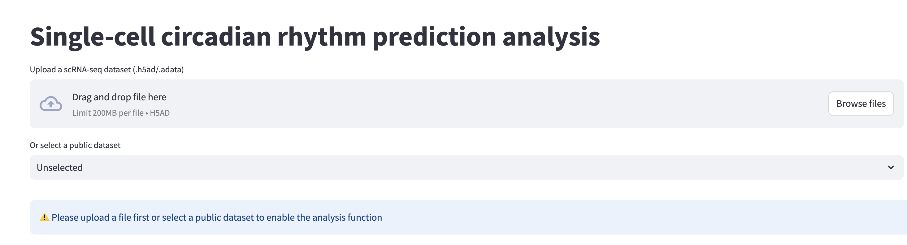
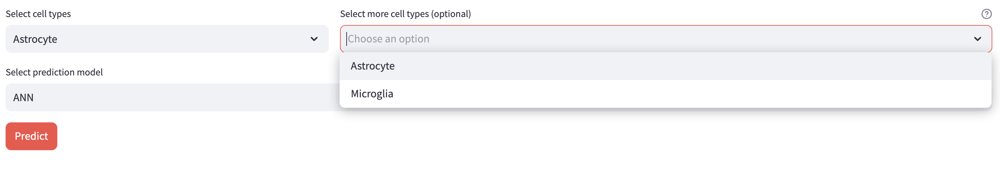
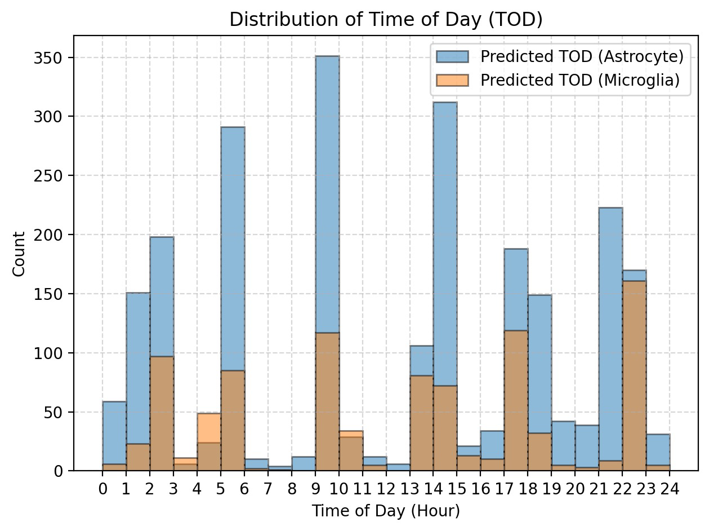
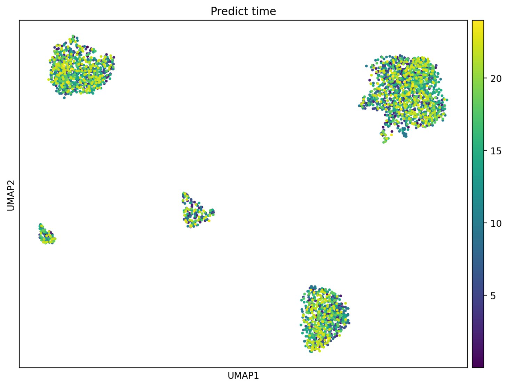
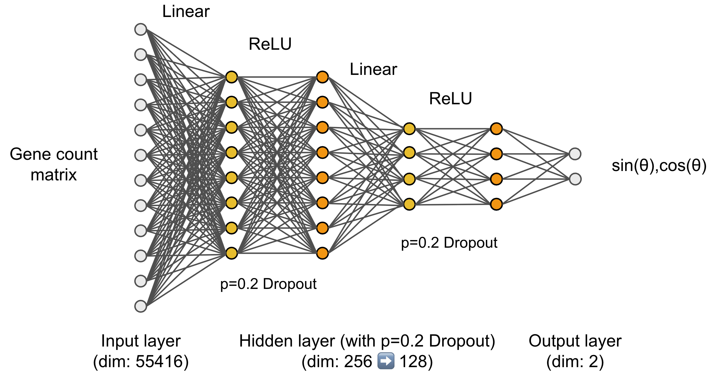

# Circafinder
## Introduction and motivation
Circadian rhythms are intrinsic, approximately 24-hour cycles that regulate various physiological processes. Disruptions in these rhythms are linked to health issues such as sleep disorders and metabolic syndromes. Traditional bulk RNA sequencing methods average gene expression across cell populations, obscuring cell-type-specific circadian dynamics. Single-cell RNA sequencing (scRNA-seq) offers the resolution to uncover these patterns at the individual cell level.

Therefore, we propose developing an open-source machine learning framework, **Circafinder**, to predict the circadian phase of individual cells using scRNA-seq data. We have designed a user-friendly Web-based interface to deploy our model. We will help the user to predict the circadian time for each cell, and provide some data profiling in this tool.

## Data source for model training
We use the public dataset (from **[Wen et al., 2020, Nat Neurosci](https://www.nature.com/articles/s41593-020-0586-x)**) to train an ANN model to predict the circadian state for each different cell type. We also provide some demo anndata objects as an example for user to test the tool.

## Tutorial
### 0. Before you start
To use the **Circafinder** tool to predict, firstly you should download the trained model in the folder of `./Model_param/`. Due to the size limit for file uploads on GitHub, **you should download the model manually from [here](https://www.dropbox.com/scl/fo/r2uesptmnarl8qglck18g/ANS0jlMhZgS1wwp4P-j8_sA?rlkey=2g3x0hswx1mg3ojp8w9zb0y9p&st=92a78f1d&dl=0).** When you download the pre-trained model, you should put the model in **correct folder**. For example, the **ANN model should put in the** `./Model_param/ANN/` **folder**.

Also, we have some Demo from public dataset. You can also download them to the `./Demo_obj/` folder. You can download them from [here](https://www.dropbox.com/scl/fo/gsztzicla8ucnk4h15nlu/AOoQyrWo4SLNr8lBCh8Gql4?rlkey=qc7pmjiovwg9na51efzhy0a5y&st=x76wp0sj&dl=0). 

The code should running in python environment, you can run
```bash
conda env create -f environment.yml
conda activate circafinder
```
Or
```bash
conda create -n circafinder python=3.10 -y
conda activate circafinder
conda install pytorch torchvision torchaudio -c pytorch -y
conda install jupyterlab numpy pandas matplotlib scipy scikit-learn scanpy anndata seaborn -c conda-forge -y
```

### 1. Start the tool
When downloaded the pre-trained model to the `./Model_param/` folder. Run the script below to launch the streamlit-based website tool.
```bash
streamlit run UI.py 
```

### 2. Loading the dataset/Choosing the existed dataset

Users could upload the dataset by themselves. But normally, the size of `.h5ad` file (anndata file) is always huge. So, if we need to upload larger file size, use `--server.maxUploadSize` when you launch the streamlit. For example, if your anndata file is ≤500 MB, you can
```bash
streamlit run UI.py --server.maxUploadSize=500
```
In this way, the file uploaded limitation will be 500 MB

We also provide some Demo from public dataset if you have already downloaded to `./Demo_obj/` folder. You can also select them as the demo of **Circafinder**.

Also, if you want to try upload the files by yourself, we also provide a Demo `.h5ad` file (Download [here](https://www.dropbox.com/scl/fi/tik2a6bl6n31wpln27q2g/Subsampled_astrocyte_microglia.h5ad?rlkey=pxebof96mq3a15ytnl6ueldnb&st=2qwx93np&dl=0)) to upload by yourself.

### 3. Select cell-type(s) and prediction model

When you successfully upload the `.h5ad` anndata file to the website, then we should choose the cell types that you want to predict the time. We trained the model specify for each individual cell type. Therefore, **you must specify the cell type you want to predict first**. So in the select box, you must select 1 cell type in the left **Radio Button**, or you can select more cell types in the right **Checkbox**. Then you should specify the prediction model you will choose. Currently, we only provide <mark>ANN pre-trained models</mark> because SVM model didn't work very well.

After finish choosing the cell type(s) and prediction model, click button `Predict`, and it will kick up prediction.

### 4. Data profiling
After finish prediction, we will do some easy profiling of the dataset. We will plot the predicted time distribution of the dataset, and also plot the time distribution in UMAP of the single-cell RNA-seq data. If you choose several cell-types, they will be plot together. The plots will look like this: ⬇️
<p align="center">
  
  
</p>

After finish plotting, you will also see a new button `Download` that you can download the prediction data

## Open-source code description (Advance usage)
**Circafinder** is an open-source machine learning tool for circadian biologist to predict "circadian state" in single-cell level. Here is the detailed description of how we train the model.
### ANN model algorithms
The step-by-step codes of ANN model training are in the file of `circafinder_test_ANN.ipynb`. You can re-run the code to repeat the training steps, or use your well-documented single-cell RNA-seq dataset to predict by yourself. But before running the `circafinder_test_ANN.ipynb`, be sure that you have prepared the proper python environment (see [0. Before you start](#0-before-you-start))

<p align="center"></p>

Here is the structure of the ANN. We use the "**raw RNA count matrix of all genes**" as the input. So the input layer will be 55416 dimensions. We also tested scaled gene expression matrix, top 500-PCs, and top-1000 highly variable expressed genes, but the **raw RNA count matrix of all genes** works the best. After input with very high dimensional RNA-expressed vector, we have **2 hidden layers from 256 neurons to 128 neurons** with 0.2 Dropout. We use ReLU as the non-linear function, to fit linear RNA-expressed vector with non-linear circadian rhythm. The dimension of final output layer is 2, because for the circadian data, **we transformed the original 0-24 hour dimension into polar coordinate forms** represented by `sin(θ)` and `cos(θ)`. Here are the core definition of our ANN model ⬇️. The detailed codes are also shown in the file of `circafinder_test_ANN.ipynb`.
```python
# Define dataset: expression matrix + times
class CircadianDataset(Dataset):
    def __init__(self, expr_matrix, times):
        """
        expr_matrix: numpy array of shape (N_cells, N_genes)
        times: numpy array of shape (N_cells,), use "hours" as unit, range: [0,24)
        """
        # Original expression matrix (float32), each row represents a cell and each column represents a gene
        self.X = expr_matrix.astype(np.float32)

        # Map the time from [0,24) to the Angle [0,2 π) on the circle and calculate sin/cos as the model label
        # This avoids the breakpoint problem of 23h ↔ 1h
        radians = times / 24.0 * 2 * np.pi
        self.y = np.stack([np.sin(radians), np.cos(radians)], axis=1).astype(np.float32)

    def __len__(self):
        return len(self.X)

    def __getitem__(self, idx):
        # Return (expression_vector, [sin(time), cos(time)])
        return self.X[idx], self.y[idx]

class CircadianNet(nn.Module):
    def __init__(self, input_dim, hidden_dims=[256, 128], dropout=0.2):
        super().__init__()
        layers = []

        # Feedforward Hidden Layer Design:
            # - First layer: Mapping from input_dim (number of genes) to 256 neurons
            # - Second Layer: 256 → 128
        # After each layer, ReLU activation is connected to enhance the nonlinear expression capability
        # And use Dropout(0.2) to prevent overfitting
        prev_dim = input_dim
        for h in hidden_dims:
            layers.append(nn.Linear(prev_dim, h))  # Fully connected layer
            layers.append(nn.ReLU())               # Activation function
            layers.append(nn.Dropout(dropout))     # Random inactivation of 20%
            prev_dim = h

        # Output layer: Two neurons, corresponding respectively to sin(time) and cos(time)
        layers.append(nn.Linear(prev_dim, 2))

        # Combine all layers in sequence
        self.model = nn.Sequential(*layers)

    def forward(self, x):
        return self.model(x)
```

### ANN model training and validation
During the training, we calculate the **Mean Squared Error (MSE)** of `sin(θ)` and `cos(θ)` as the training loss:

Given model predictions $\hat{y} = [\sin(\hat{\theta}), \cos(\hat{\theta})]$  
And true labels $y = [\sin(\theta), \cos(\theta)]$ 
The MSE is computed as:

$$` \mathrm{MSE} = \frac{1}{N} \sum_{i=1}^N \left( (\hat{y}_{{i,1}} - y_{{i,1}})^2 + (\hat{y}_{{i,2}} - y_{{i,2}})^2 \right) `$$


Where:
- $N$ is the number of training samples
- $`\hat{y}_{{i,1}}`$ and $`\hat{y}_{{i,2}}`$ are the predicted $\sin$ and $\cos$ values
- $y_{i,1}$ and $y_{i,2}$ are the ground truth $\sin$ and $\cos$ values


For the validation set, we calculate the **circular MAE** of `sin(θ)` and `cos(θ)` between predicted and true time-of-day angles:

Given predicted output $\hat{y} = [\sin(\hat{\theta}), \cos(\hat{\theta})]$  
and true labels $y = [\sin(\theta), \cos(\theta)]$:

1. Convert sine/cosine vectors back to angles:
$$ \hat{\theta} = \text{atan2}(\hat{y}_{\sin}, \hat{y}_{\cos}), \quad \theta = \text{atan2}(y_{\sin}, y_{\cos}) $$

2. Compute the circular angle difference in $[-\pi, \pi]$:
$$ \Delta \theta = \text{mod}(\hat{\theta} - \theta + \pi, 2\pi) - \pi $$

3. Convert radians to hours and compute the average:
$$ \text{Circular MAE} = \frac{24}{2\pi} \cdot \frac{1}{N} \sum_{i=1}^N |\Delta \theta_i| $$

Explanation:
- `atan2(sin, cos)` recovers the original angle in radians
- The `mod` operation ensures correct wrap-around between hours (e.g., 23:00 and 01:00 is 2 hours apart)

Here are the core codes for training ⬇️. The detailed codes are also shown in the file of `circafinder_test_ANN.ipynb`.
```python
def train(model, dataloader, optimizer, criterion, device):
    model.train()
    total_loss = 0.0
    for X_batch, y_batch in dataloader:
        X_batch = X_batch.to(device)
        y_batch = y_batch.to(device)

        optimizer.zero_grad()
        out = model(X_batch)
        loss = criterion(out, y_batch)
        loss.backward()
        optimizer.step()

        total_loss += loss.item() * X_batch.size(0)
    # Return mean loss
    return total_loss / len(dataloader.dataset)

def circular_mae(pred, true):
    """
    Calculate the Circular mean absolute error (Circular MAE) and the predicted sin/cos vector
    After converting to an Angle, calculate the minimum radian difference from the true Angle and then convert it to hours.
    """
    # atan2 param：sin, cos
    ang_pred = torch.atan2(pred[:,0], pred[:,1])
    ang_true = torch.atan2(true[:,0], true[:,1])
    # Normalize errors to [-π, π]
    diff = torch.remainder(ang_pred - ang_true + np.pi, 2*np.pi) - np.pi
    # Convert the radians to hours，24h correspondes to 2π
    return torch.mean(torch.abs(diff)) * (24/(2*np.pi))

def evaluate(model, dataloader, device):
    model.eval()
    total_mae = 0.0
    with torch.no_grad():
        for X_batch, y_batch in dataloader:
            X_batch = X_batch.to(device)
            y_batch = y_batch.to(device)
            out = model(X_batch)
            total_mae += circular_mae(out, y_batch).item() * X_batch.size(0)
    return total_mae / len(dataloader.dataset)
```

# Further Issues and questions ❓
If you have issues or questions, don't hesitate to contact us:
- **Lihan Zhong**, lzhong01@rockefeller.edu, Graduate Fellow, Laboratory of Single-cell Genomics and Population Dynamics, The Rockefeller University
- **Ahmet Doymaz**, adoymaz@rockefeller.edu, Biomedical Fellow, Laboratory of Single-cell Genomics and Population Dynamics, The Rockefeller University